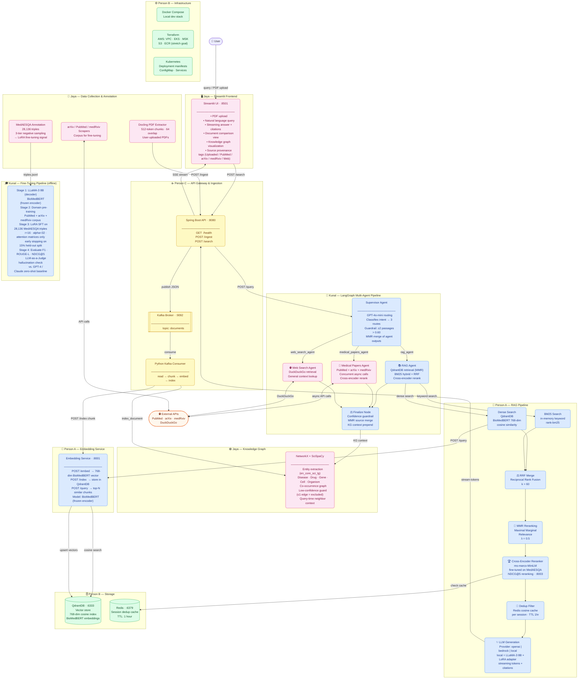
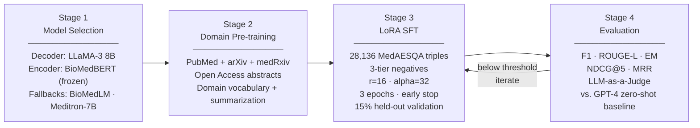
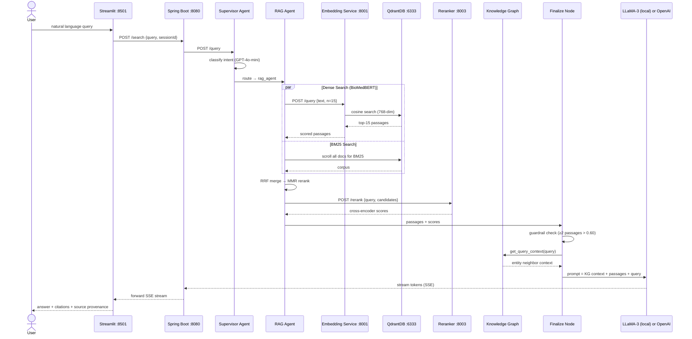
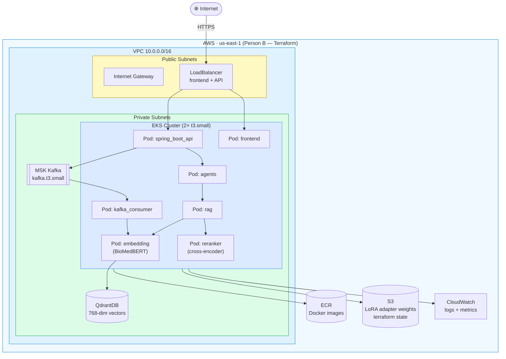
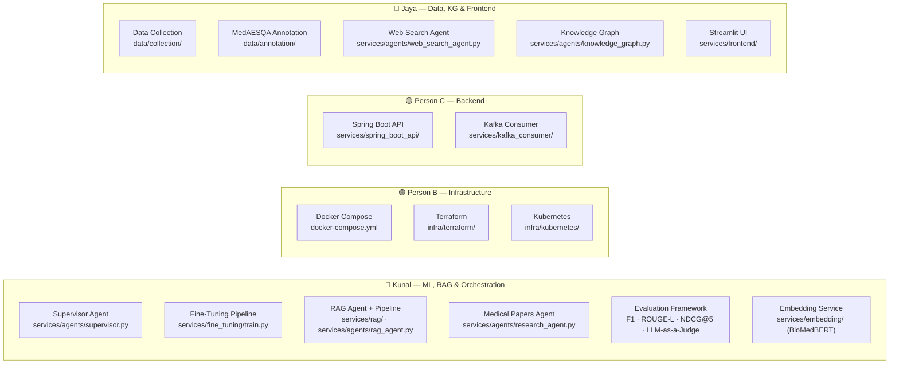

# MediQuery — System Architecture

## Full System Diagram

---

## Fine-Tuning Pipeline — Four Stages

---

## Query Flow — Step by Step

---

## AWS Deployment Architecture (Stretch Goal — Weeks 10-11)

---

## Component Ownership

