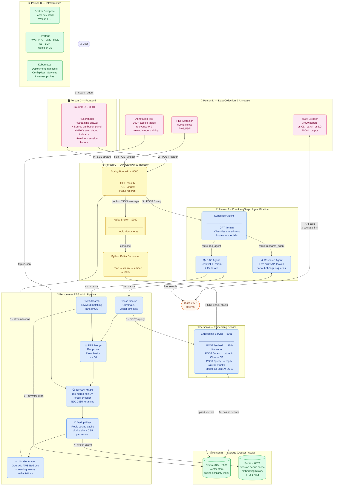
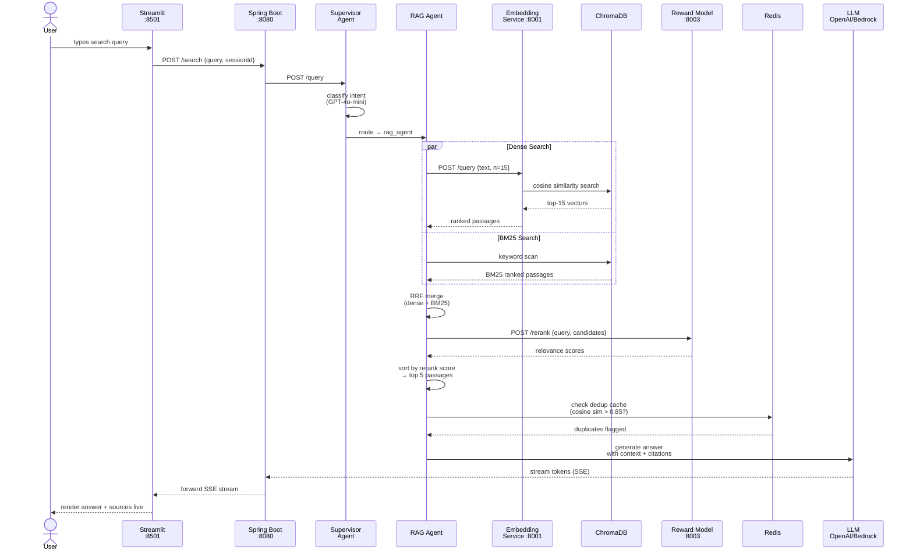
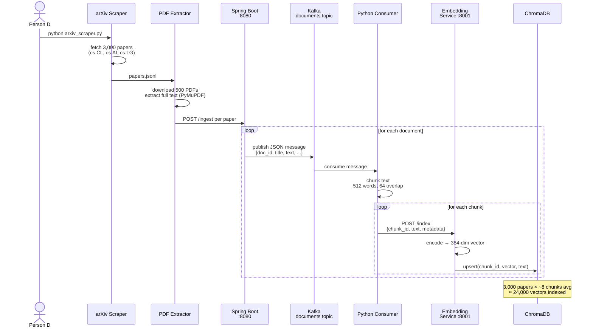
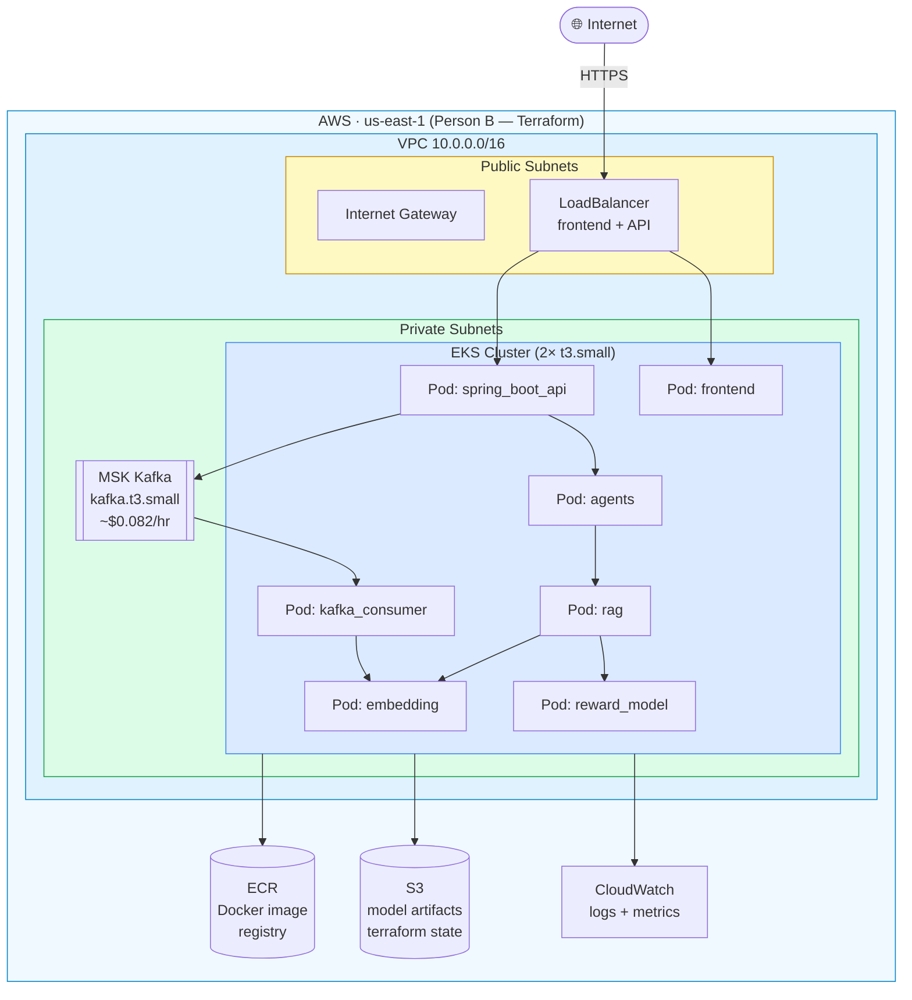
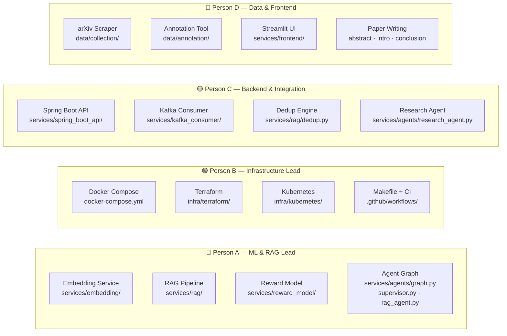

# System Architecture

## Full System Diagram

---

## Query Flow — Step by Step

---

## Ingestion Flow — Step by Step

---

## AWS Deployment Architecture (Weeks 9–10)

---

## Component Ownership at a Glance

